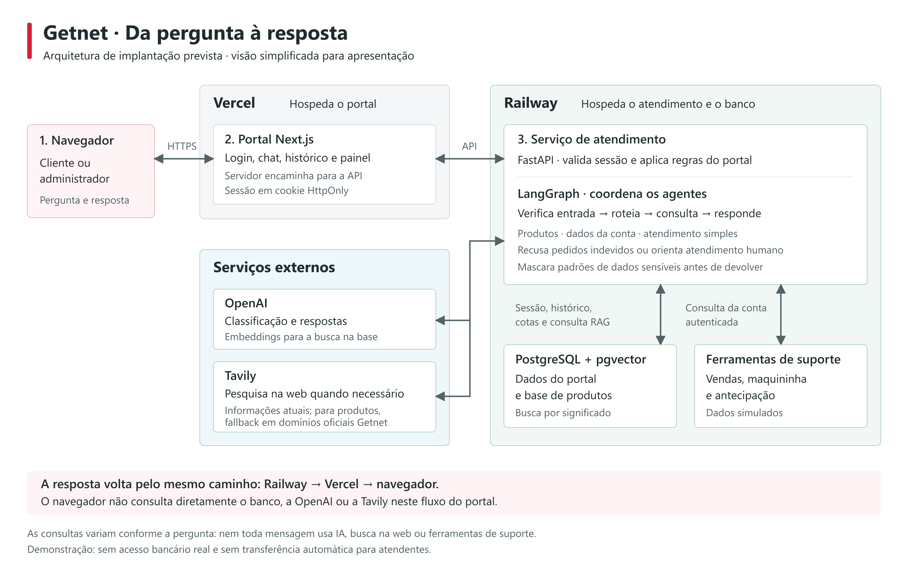

# Apresentação do assistente multiagente Getnet

## Mensagem principal

O projeto demonstra um atendimento digital que entende o assunto da pergunta e escolhe o caminho mais adequado para responder. Ele combina conhecimento sobre produtos, consultas demonstrativas da conta do cliente e busca de informações atuais, com controles de acesso e segurança.

## Roteiro de fala (cerca de 3 minutos)

> Desenvolvi um assistente de atendimento para clientes Getnet. A proposta não é simplesmente colocar um chat de inteligência artificial na frente do cliente. O sistema reconhece o que a pessoa precisa e encaminha a pergunta para uma função especializada.
>
> Se o cliente pergunta como funciona a antecipação de recebíveis, o assistente procura a resposta numa base de conhecimento sobre produtos. Se pergunta quando vai receber pelas suas vendas, ele consulta informações demonstrativas associadas à sua própria conta. E, se a pergunta exige algo atual, como a cotação de uma moeda, ele faz uma busca na web.
>
> Para organizar esse trabalho, usamos agentes com papéis diferentes. Um classifica a pergunta, outro trata dúvidas de produtos e informações gerais, outro consulta os dados demonstrativos do cliente. Interações simples, como "olá" e "obrigado", recebem respostas diretas, sem uma pesquisa desnecessária.
>
> A segurança faz parte do fluxo: antes da resposta, o sistema verifica tentativas de mudar suas regras e pedidos de dados de terceiros. Uma consulta de conta usa a identidade do cliente autenticado, não o nome ou identificador digitado na conversa. A resposta também passa por uma verificação para mascarar dados sensíveis.
>
> Além da conversa, criei um portal com login, histórico, acesso administrativo, limites mensais de uso e um painel para acompanhar o consumo dos modelos. Assim, o projeto demonstra tanto a experiência do cliente quanto os controles necessários para acompanhar a operação.
>
> Este ainda é um ambiente demonstrativo: os dados de conta são simulados e, quando o assistente indica atendimento humano, ele não abre um chamado nem transfere a conversa. O próximo passo para uma operação real seria integrar sistemas de clientes e atendimento, validar as fontes e avaliar as respostas em uso real.

## Como explicar a arquitetura sem jargão

Pense em uma equipe com tarefas definidas:

| Função | O que faz |
| --- | --- |
| Checagem de entrada | Identifica pedidos inseguros antes de acionar os agentes. |
| Roteador | Decide que tipo de atendimento a pergunta precisa. |
| Conhecimento | Consulta a base de produtos ou faz busca na web quando precisa de informação atual. |
| Suporte | Consulta dados demonstrativos do cliente autenticado, como vendas e status da maquininha. |
| Atendimento simples | Responde saudações, agradecimentos e pedidos fora do escopo sem pesquisa. |
| Recusa ou orientação humana | Recusa pedidos indevidos; em casos que exigem uma pessoa, orienta o uso dos canais oficiais. |
| Checagem de saída | Mascara padrões de dados sensíveis na resposta. |

**Em uma frase:** a mensagem é verificada, encaminhada à função certa e revisada antes de chegar ao cliente.

## Ferramentas e arquitetura: como tudo se conecta

Pense no projeto em três camadas. O **portal** é o lugar onde o cliente conversa e o administrador acompanha o uso. O **serviço de atendimento** recebe a mensagem e coordena os agentes. A **camada de dados** guarda conversas e limites de uso, além da base pesquisável sobre produtos.

**Desenho da implantação prevista:**

[Abrir o desenho em tamanho completo](docs/arquitetura-getnet.png)

Na apresentação, acompanhe os blocos numerados da esquerda para a direita: o cliente fala com o portal, o portal encaminha a pergunta ao atendimento, e o atendimento consulta a fonte apropriada antes de devolver a resposta. Os blocos inferiores mostram os dados e os serviços externos consultados conforme a necessidade. **Vercel para o portal e Railway para a API e o banco são a arquitetura de implantação prevista**, não uma afirmação de que todos os serviços já estão publicados. OpenAI e Tavily são serviços externos; as ferramentas de suporte consultam dados simulados, não uma base bancária da Getnet.

**Caminho de uma pergunta:**

1. O cliente entra no portal e envia a pergunta. A identidade usada nas consultas vem da sessão autenticada, não do que foi escrito no chat.
2. O serviço verifica a mensagem. Pedidos inseguros podem ser recusados antes mesmo de chamar um modelo de IA.
3. O roteador identifica a intenção e encaminha a pergunta: produto, informação atual, consulta da conta ou atendimento simples. Saudações e despedidas conhecidas são respondidas diretamente.
4. O agente escolhido obtém os fatos de que precisa. Para produtos, procura trechos na base; para informações atuais, pesquisa na web; para a conta, chama ferramentas que consultam **dados simulados do cliente autenticado**.
5. Quando há geração por IA, o modelo redige a resposta a partir desses fatos. Se não houver evidência suficiente sobre um produto, o sistema tenta uma busca restrita a sites oficiais Getnet; se ainda faltar informação, deve dizer que não conseguiu confirmar.
6. A resposta passa por uma verificação de dados sensíveis e volta ao portal. O sistema registra o percurso da pergunta e o consumo dos modelos para análise.

| Ferramenta | Papel no projeto | Forma simples de explicar |
| --- | --- | --- |
| **Next.js** | Interface do portal de cliente e administrador. | É a parte que as pessoas veem: login, chat, histórico e painel. |
| **FastAPI (Python)** | Serviço que recebe pedidos do portal, verifica a sessão e devolve respostas. | É a porta de entrada para as regras do atendimento. |
| **LangGraph** | Organiza as etapas e o encaminhamento entre agentes. | É o fluxo de trabalho da equipe: decide quem atende depois de cada etapa. |
| **OpenAI** | Modelos para classificar perguntas e escrever respostas; outro modelo cria representações para a busca na base. | A IA ajuda a interpretar, localizar conteúdo parecido e redigir, mas não escolhe livremente os dados de outros clientes. |
| **Base de conhecimento + pgvector** | Guarda conteúdo de produtos em partes pesquisáveis por semelhança de significado. | É como localizar os parágrafos mais relevantes antes de responder, em vez de confiar apenas na memória da IA. |
| **Tavily** | Pesquisa páginas da web quando a informação é atual ou quando falta contexto sobre um produto. | É a pesquisa externa; para produtos, o fallback é limitado a domínios oficiais Getnet. |
| **PostgreSQL** | Guarda usuários, sessões, conversas, cotas e registros de consumo, além do índice de produtos. | É a memória organizada do portal e da base de conhecimento. |

**RAG versus busca na web:** RAG é a consulta à base de produtos preparada previamente; a web é consultada no momento da pergunta. A base principal de produtos é **curada a partir de informações públicas**. O site pode complementar a ingestão, mas não é copiado automaticamente por completo. Já uma cotação ou previsão depende de fontes externas recentes e pode não estar atualizada.

**O que mantém o fluxo controlado:** a autenticação limita consultas à própria conta; o guardrail verifica pedidos e saídas; as cotas limitam o uso de modelos por cliente e no total; e o histórico do percurso ajuda a investigar respostas. Esses controles reduzem riscos, mas não substituem validação de fontes e testes com usuários reais.

## Demonstração sugerida

1. **"Como funciona a antecipação de recebíveis?"** Mostra a consulta a informações de produtos e as fontes exibidas na resposta.
2. **"Quando recebo pelas minhas vendas?"** Mostra a consulta demonstrativa vinculada à conta autenticada, sem afirmar que se trata de dados bancários reais.
3. **"Quero ver os dados de outro cliente."** Mostra a recusa de acesso a informações de terceiros.
4. **"Qual a cotação do dólar hoje?"** Mostra a busca na web; confira a data das fontes antes de apresentar o resultado como atual.

## Perguntas que o gerente pode fazer

**Por que usar vários agentes em vez de um único chatbot?** Para separar responsabilidades: responder sobre produtos, consultar dados da conta e buscar informações atuais exigem fontes e cuidados diferentes. Isso facilita entender o caminho seguido por cada resposta.

**O sistema acessa dados reais da Getnet?** Não. As consultas de vendas, maquininha e antecipação usam dados simulados. Integração com sistemas reais é uma etapa futura.

**Ele transfere para um atendente?** Não. Ele reconhece a necessidade e orienta o cliente a procurar os canais oficiais, mas não cria ticket nem transfere a conversa.

**A segurança é garantida?** Não existe garantia absoluta. Há controles de acesso, verificações antes e depois da resposta e testes de tentativas de burlar regras. Ainda é necessária avaliação contínua com perguntas e fontes reais.

**Como controlar o uso?** O portal permite configurar cotas mensais de tokens de entrada e saída por cliente e para a operação, além de mostrar consumo e chamadas em um painel. Essas cotas não incluem embeddings nem buscas Tavily.

## Fechamento

> O projeto demonstra que é possível combinar respostas úteis com caminhos claros de consulta, controle de acesso e visibilidade de uso. O valor da próxima fase está em validar as fontes, medir a qualidade das respostas em cenários reais e conectar o assistente aos sistemas operacionais, sem confundir a demonstração atual com um atendimento bancário em produção.